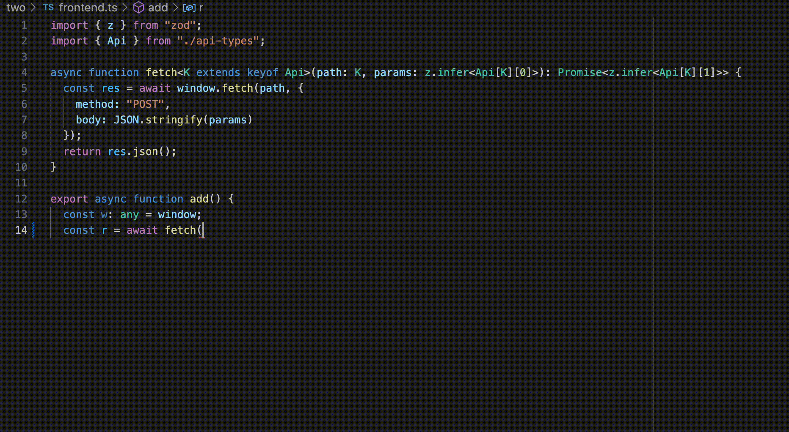

# Type Level Programming

## One
This repo contains properly commented code for the "Type-Level Programming"
[PagedOut! issue #4](https://pagedout.institute/download/PagedOut_004_beta1.pdf) article.

The code will only type check if the `MagicSquare` types contain a
magic square array. A magic square is a grid of numbers where the columns, rows,
and both main diagonals all have the same sum. In addition, all elements must
be different.

You can run the typechecker with:

```bash
cd one/
npm install
npm run tsc
```

## Two
Code for the "More Type-Level Programming" [PagedOut! issue #4](https://pagedout.institute/download/PagedOut_004_beta1.pdf) article.

It's best to play with the code in your IDE -- you'll then see how the IDE uses the types
to provide useful typing suggestions.



You can also run the code with:
```bash
cd two/
npm install
npm run tsc
npm run server
```

and then open http://127.0.0.1:3000/ in your browser.
